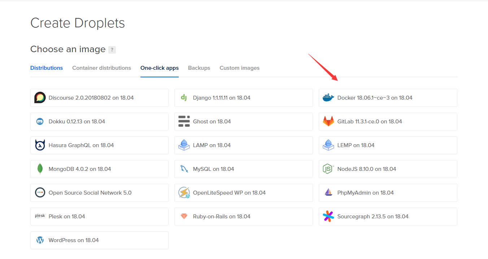
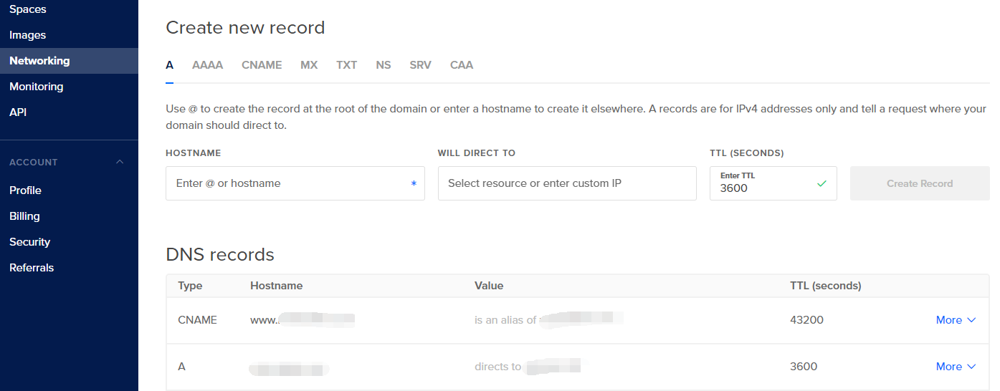

# Setting Up Back End In Digital Ocean

I assume you have basic knowledge on VPS and how to troubleshoot Ubuntu, let me know if you need more details.

# 1. Create a droplet(VPS)


We need docker, so choose docker One-click apps.

# 2. DNS Records



If you have domain name, you can set the DNS records in networking tab.

# 3. Create a sudo user with home directory

Download Bitvise: https://www.bitvise.com/ into your own computer, Bitvise is a very handy GUI SSH client, I really recommend it, it saves me from remembering some bash commands.

Login into the VPS using Bitvise and follow this guide:
https://www.digitalocean.com/community/tutorials/initial-server-setup-with-ubuntu-16-04

# 4. Copy back end code into VPS

Now login to the Ubuntu VPS with the newly created user using Bitvise, do not work with root user because by doing so it poses some security issue.

Using Bitvise SFTP window, create a "BackEnd" folder(any name is fine), and paste the back end code in it , you dont need to copy everything, just copy the necessary code.

# 5. Install NPM and Caddy in VPS

Now open the Bitvise terminal console,

Install NPM:

```
sudo apt update
sudo apt install nodejs npm
```

Install Caddy and allow HTTP + HTTPS communication:

```
CADDY_TELEMETRY=on curl https://getcaddy.com | bash -s personal
sudo ufw allow 80
sudo ufw allow 443

```

Caddy is a load balancer and proxy like Nginx but much easier to use.

# 6. Start the Back End Server

cd into BackEnd folder,

Install the libraries:

```
npm i
```

If you want to run test server:

```
npm run test-setup
```

The scripts will setup everything for you, read more at: https://github.com/tylim88/create-prisma-app

Then run some test to make sure that it is fine:

```
npm run jest-test
```

If everything is correct then all tests will pass and the Node server is up but we have yet to setup reverse proxy and HTTPS.

# 7. Setup Caddy reverse proxy

In the BackEnd folder, create a file and name it "Caddyfile" and this configuration:

```
node.mydomain {
    proxy / localhost:4000/
}

prisma.mydomain {
    proxy / localhost:41462/
}
```

you need to also configure the DNS record for this two subdomain.

node.mydomain is your application server and prisma.mydomain is your ORM server.

```
Caddy
```

In the same directory with the Caddy file, start Caddy and the reverse proxy is working now.

Bonus: Caddy will take care the SSL certificate for you and redirect HTTP request to HTTPS request, pretty neat huh?
