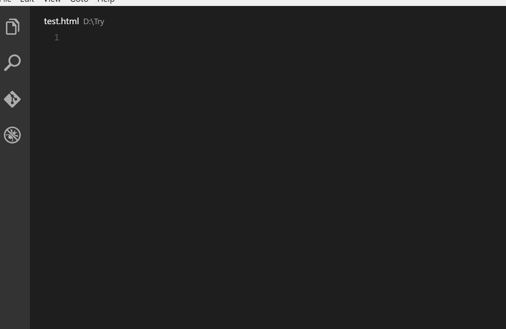

# VS Code Extensions

Why the free, open source, rich functionalities VS Code?

It has source control integrated, allows you to add, commit, and push in few clicks. Not to mention the built in terminal which is pretty handy.

VS Code is highly polished, it brings great user experience and is getting better and better with each update. It feels so good just by typing on it.

Although it consume much higher memory resource, but since modern computer normally has 8GB ram or above, it is more than enough to handle it.

With open source comes great community, with great community comes great extensions, most extensions listed were compared to alternatives in term of functionality, popularity and ease of use.

I choose what I believe is the best, you are free to have your own options, you should be able to find similar extension in your favorite editor.

## 1. Auto Close Tag

_formulahendry.auto-close-tag_

Automatically add HTML/XML close tag, same as Visual Studio IDE or Sublime Text does.

Comment: Annoying at first, but convenience if you get used to it.

## 2. Auto Import

_steoates.autoimport_

Automatically finds, parses and provides code actions and code completion for all available imports. Works with Typescript and TSX.

Comment: Convenience, another similar extension by Martin Oppitz is kind of broken, it imports at unexpected line.

Note: the gif is taken from other extension.

## 3. Auto Rename Tag

_formulahendry.auto-rename-tag_

Automatically rename paired HTML/XML tag, same as Visual Studio IDE does.

Comment: very convenience, there is no reason not to use it.

## 4. Babel JavaScript

_mgmcdermott.vscode-language-babel_

JavaScript syntax highlighting for ES201x, React JSX, Flow and GraphQL.

Comment: After comparison, I believe this is the best syntax highlighting.

## 5. Bracket Pair Colorizer

_coenraads.bracket-pair-colorizer_

This extension allows matching brackets to be identified with colours. The user can define which characters to match, and which colours to use.

Comment: Can be confusing but it is better than without it.

## 6. Docker

_peterjausovec.vscode-docker_

The Docker extension makes it easy to build, manage and deploy containerized applications from Visual Studio Code

Comment: There is no reason not to use it if you are using docker.

## 7. DotENV

_mikestead.dotenv_

A port of DotENV for vscode.

Comment: Simple and useful syntax highlighter.

## 8. ES7 React/Redux/GraphQL/React-Native snippets

_dsznajder.es7-react-js-snippets_

This extension provide you Javascript and React/Redux snippets in ES7 with babel plugins features for Vs Code

Comment: Many alternatives out there but personally I think this is the best. Useful but I often forget about it existence.

Note: the gif is taken from other extension.

## 9. GitLens — Git supercharged

_eamodio.gitlens_

GitLens supercharges the Git capabilities built into Visual Studio Code. It helps you to visualize code authorship at a glance via Git blame annotations and code lens, seamlessly navigate and explore Git repositories, gain valuable insights via powerful comparison commands, and so much more.

Comment: Very useful vs code git extension especially if you work in a team.

## 10. Import Cost

_wix.vscode-import-cost_

This extension will display inline in the editor the size of the imported package. The extension utilizes webpack with babili-webpack-plugin in order to detect the imported size.

Comment: You need this if you want to optimize your package size.

## 11. indent-rainbow

_oderwat.indent-rainbow_

This extension colorizes the indentation in front of your text alternating four different colors on each step. Some may find it helpful in writing code for Nim or Python.

Comment: Not impactful but still nice to have. Very useful if you work with indent sensitive file.

## 12. Code Spell Checker

_streetsidesoftware.code-spell-checker_

A basic spell checker that works well with camelCase code.

Comment: Comes with GUI, easy to use, would be better if it uses red color for linter. It doesn't check on grammar though.

# 13. Prettier - Code formatter

_esbenp.prettier-vscode_

VS Code package to format your JavaScript / TypeScript / CSS using Prettier.

Comment: I would say this is a **must have** extension, it save your trouble styling your code, work with eslint. It is also available in npm to install as developer dependency.

Recommended setting:  
"prettier.eslintIntegration": true,  
"editor.tabSize": 2,  
"editor.formatOnSave": true,  
"editor.formatOnSaveTimeout": 5000,  
"prettier.singleQuote": true,  
"javascript.preferences.quoteStyle": "single",
"prettier.jsxSingleQuote": true,
"prettier.trailingComma": "es5"

# 14. React Pure To Class

_angryobject.react-pure-to-class-vscode_

Replaces pure functional react components with class components.

Comment: Change component to React component with ease.

# 15. Settings Sync

_shan.code-settings-sync_

Synchronize Settings, Snippets, Themes, File Icons, Launch, Keybindings, Workspace and Extensions Across Multiple Machines Using GitHub Gist.

Comment: Save your extensions and save you from headache trying to reinstall them in new machine.

# 16. CircleCI

_jvandyke.vscode-circleci_

CircleCI commands and status

Comment: Access the status of your push without visiting github or circle ci dashboard.

# 17. :emojisense:

_bierner.emojisense_

Adds suggestions and autocomplete for emoji to VS Code.

Comment: The rest of emoji extensions is not intuitive as this one.

# 18. Open Folder Context Menus for VS Code

_chrisdias.vscode-opennewinstance_

Quickly open a new instance of VS Code from the Explorer

Comment: Handy small tool.
