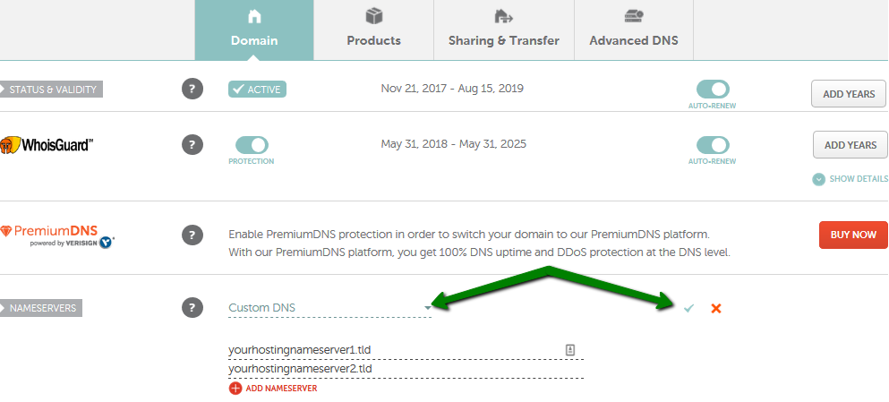

# Global Serverless Deployments with Now


Zeit Now make Node serverless deployment easy, probably the easiest solution available on market.

Here is the step on how to setup the deployment:

read everything in:  
https://zeit.co/docs/v1/clients/now-cli/

## 1. Install now cli

```
npm i -D now
```

Why not install globally?

Because I like to keep everything in project so that when people reuse my project, they simply run "npm i" and every tools is ready.

read more at:  
https://zeit.co/docs/v1/clients/now-cli/

## 2. Create a add a "now" key in package.json

**Using Now version 1**

I prefer cleaner root directory so instead of now.json, I configure Now in package.json, all the properties is optional

```
  "now": {
    "version": 1,
    "name": "MyAppName",
    "dotenv": ".env file path", // read environment variable from dotenv file
    "env": {
      "NODE_ENV": "production" // exclude dev-dependency from installation, this also mean that you might want to install some dev-dependency as dependency if you rely on them in npm scripts "build" and "start" because Now use these two scripts to build and start
    },
    "alias":"MyDomainName" // when you run "now alias" command after deployment, it will pick up this alias key's value as argument
  }
```

you can also combine "dotenv" and "env" json properties by moving all environment variable of "env" into the dotenv file, I recommend this because it will not expose you configurations and secret in your package.json which you need to upload to github

```
  "now": {
    "version": 2,
    "name": "MyAppName",
    "dotenv": ".env file path",
    "alias":"MyDomainName"
  }
```

Finally it will looks like this.

read more at:  
https://zeit.co/blog/now-json

https://zeit.co/docs/v1/features/build-env-and-secrets/

https://zeit.co/docs/v1/features/env-and-secrets/

https://zeit.co/docs/v1/features/configuration/

**Using Now version 2**

Now version 2 has more restrictions on now.json file:

- we must create a now.json in root directory, you can no longer define it in package.json.
- we are not allow to use dotenv file, making injecting environment variable less flexible.

here is how your now.json should look like:

```
  "version": 2,
  "name": "MyAppName",
  "builds": [
    {
      "src": "next.config.js",
      "use": "@now/next"
    }
  ],
  "alias": "MyDomainName",
  "env": {
    "secret":secret
  }
```

read more at:
https://github.com/zeit/now-examples/tree/master/nextjs

## 3. Custom domain name

point your domain name to Zeit name servers

```
a.zeit.world	96.45.80.1	2600:180a:1001::1
b.zeit.world	46.31.236.1	2600:180b:2001::1
c.zeit.world	43.247.170.1	2600:180c:3001::1
d.zeit.world	96.45.81.1	2600:180a:4001::1
e.zeit.world	46.31.237.1	2600:180b:5001::1
f.zeit.world	43.247.171.1	2600:180c:6001::1
```

Various registrars has different but in general the same logic on how to change domain's DNS, this example demonstrates Namecheap,


You also need to reflect the DNS for Namecheap Private Email by setting these DNS records:

```
now dns add dinewithme.app @ MX mx1.privateemail.com 10
now dns add dinewithme.app @ MX mx2.privateemail.com 10
now dns add dinewithme.app @ TXT 'v=spf1 include:spf.privateemail.com ~all'
```

read more at:  
https://www.namecheap.com/support/knowledgebase/article.aspx/767/10/how-to-change-dns-for-a-domain

https://www.namecheap.com/support/knowledgebase/article.aspx/1340/2176/namecheap-private-email-records-for-domains-with-thirdparty-dns

https://zeit.co/blog/now-dns

## 4. Deployment

create a npm scripts and run it

```
"deploy": "now && now alias && now alias"
```

Note: you can use shorthand `now alias` instead of `now alias mydomain` if you defined your alias name in package.json

read more at:  
[how to change name servers](https://www.youtube.com/watch?v=wNqsPau-cyE)

https://zeit.co/dns#get-started

https://zeit.co/docs/v1/features/path-aliases/

https://zeit.co/docs/v1/features/dns/

## 5. Scaling

Now will delete your instance if the instance is inactive, which mean it will go through the reinstallation and rebuild process when someone visit the site again, this is not good because the "first batch" visitors will need to wait for long time, in this case we need to set the instance to minimum 1 instance and maximum 3(or auto) instances for free plan.

```
now scale mydomain 1 auto
```

tips-1: you can also combine this command into step 4's npm scripts, so the whole thing looks like

tips-2: to make thing easier, you can also add `now rm MyAppName` into the script, this will remove old deployment before deploying new one, this is optional as Now allow you to have infinite deployment(but keep in mind the instances are limited).

```
"deploy": "now rm MyAppName && now && now alias && now alias && now scale mydomain 1 auto"
```

read more at:  
https://zeit.co/blog/scale

https://zeit.co/docs/v1/features/scaling/

## 6. But wait, there is one more thing, redirecting wwww domain to naked domain!

Of course you can create a new www.mydomain alias but to get the most link juice out of search engine optimization, the best way is status 310 redirecting.

The way to do it is to create an empty website that redirect visitor to naked domain, check this example: https://github.com/zeit/now-examples/tree/master/redirect

read more at:  
https://ericsachsseo.com/complete-guide-best-practices-url-redirects/

https://en.wikipedia.org/wiki/HTTP_301

https://www.raygesualdo.com/posts/301-redirects-with-nextjs/

## 7. Finally

That is it, you should be able to visit your website Now(pun) with your custom domain name, if you dont like to use now-cli then you also can configure your deployment and alias at https://zeit.co/dashboard/deployments
