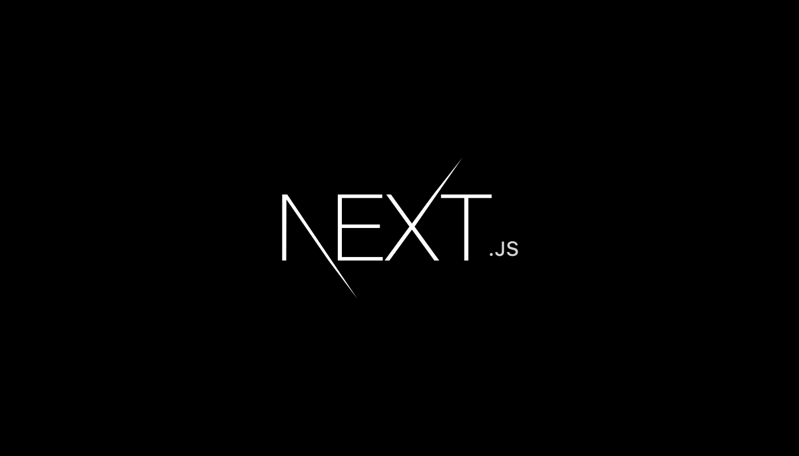

# Front End Technologies

Depend on a lot of factors and needs, libraries will change from time to time.

Here is simple justification of important library that we are going to use.

## 1. React

We use react to build user interface. Personally I like the idea of component, it changes the philosophy of separation of concern. It increase the learning curve as it requires a programmer to have all kinds of knowledge (html+js+css).

However this doesn't necessary increase the workload as others can work on another component without you involved in it. The best thing is, component thinking allows us to reuse the resources easily. I believe this is a correct direction.

But why react? Because there are also library that adopt or gravitate toward component thinking, why react?

Again my answer for this is quite simple: stable and reputed, it is a safe choice.

- More job opportunities, it is easier to get people to join this project especially fot those who want to gain experience.
- It has big ecosystem, resourceful, lots of library created around react.
- Big ecosystem also means, technical problems that you encountered are most likely answered on internet.
- It developed by big company, it will last longer.

If I would pick up another library, I think Vue is a good choice and Imba is very interesting tech to keep eye on.

## 2. Next

There are actually not much React frameworks out there when come to server side renderer, presumably Next, Gatsby and After. Why we need server side rendering? Basically 2 reasons: performance and search engine optimization.

Server side rendering effectively reduce round trip make to server, it is much cost effective to serve as much as possible in one round trip, an analogy in real world would be if you want to fetch 20 people but your car can only carry 5 people, you would carry 5 people per trip because that is the most effective way to do so. Thing will get complicated if the payload getting bigger but we wont go deep in this paragraph.

In older time, we can only do server side or client side rendering but not both, ssr allows webpage with its UI and dynamic data ready when the page is loaded but the page is static, you are not able to change the UI on the page but you still able to fetch data with AJAX. Serving static site is fast and fast is good, everything is ready when page is loaded, it improves user experience, however it may not be fast at all level because the initial page load is longer.

In the world of internet, we all at the mercy of Google (joke, Google actually want related site to be discover). To improve your Google search ranking, you need to tell Google what your site are and the way to do so is to let Google crawl your page and understand your content as much as possible.

But when you send a React page, you are actually sending skeleton html page with no content for Google to crawl, the content only available after client finish render it, here is why server side rendering shine. Yes, google is improving client side rendering crawling algorithm but that is still not enough.

Why we need client side rendering? Basically 1 reason: user interactive.

Single page application is example of client side render, it is called "application" because csr allows the UI to be rendered on client side dynamically and make web app much more application like. Why "single page"? Because it is like having one application in one url(having many urls are very possible).

If you can change what to be appeared in the browser, it make user interactive richer and much more fun, you can even create a game out of it. Client side rendering also have faster initial page load, but experience of waiting for all pieces to be put together can be awful.

That is why I choose Next, because Next is actually an universal renderer, it can renders both client side and server side, we can have the best of both. We can have everything ready on the server side and at the same time provide rich interactive user experience on the client side.

Other than Next, Gatsby is extremely attractive option is you want to host static page(Next also can do the same), it is blazing fast, I strongly recommend it but somehow tricky to render dynamic content with Gatsby(I dont have much research yet); speaking about After, After is fairly new and heavily inspired by Next, the different is After adopt different routing philosophy (which Next will adopt too).

## 3. Redux

_this paragraph is deprecated, now we use Unstated but keep this for the purpose of reading_

There are a lot of state management library out there, but I dont have much experience to comment on all of them.

Redux it self is great, but it could be confusing for new learner, I think redux has too much code to do simple thing, not to mention you need middleware to handle async action, adding complexity.

Here is an article I wrote on how to redux some times ago:

Summarize on how redux work

1, so first thing first, redux has nothing to do with react, despite the name sound is similar you can use redux in anywhere, react-redux library is the library that blend them together.

2, in big picture store replace your state, action(or precisely action function) replace the method, reducer become the method that handle only the state change

3, action and reducer are both related to store, they must have a store to work with, however action does not directly relate to reducer, you dont need to specify which action trigger which reducer, the reason is simple, any action will trigger all the reducers(because you combine all the reducers) and execute any match case if available.

4, store dispatch the action, in plain english, it use the information from 'action' and tell every reducers what to do, basically just two type of info, which case(action.type) and what state(action.payload).

5, after reducers finish their job, they return all the states to store.

Redux is what most people familiar with plus it play well with Next so I will stick with it for now, but tiny library like Unstated and Meiosis seem worth considering too.

## 4. Now

When come to deployment, Now is probably the most attractive platform to deploy our app from, it has global DNS and global CDN(only in paid plan) but this is not the reason behind the attraction.

It is because of how easy to deploy app on it, you can do it in just one command and your website is online now(pun) plus automatic SSL certification, pay some fee and you get a global CDN and anti DDoS.

This means a lot for sole developer which is just impossible to micromanage everything. As a sole developer you should always put more resources in developing your app, not server and infrastructure because we simply dont have that much of time.

Now make your life a breeze but of course Now is not the only serverless out there, there are Heroku, Cloudflare, Digital Ocean, Hostgator and big names like IBM, Google, Microsoft and Amazon but none of it is as easy as Now when come to deploying Node app, the closest one would be Heroku.

Extra: Now and Next are actually developed by the same company, Zeit.
