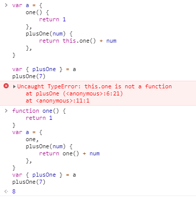
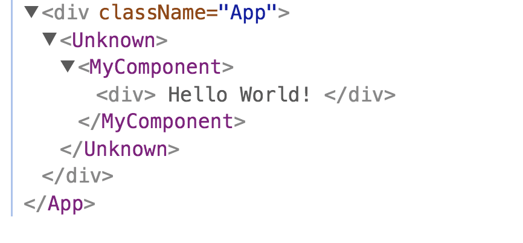
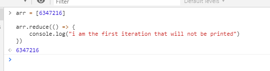

# Good Code

This section is a mixture of JS and React.

## Pure function

If possible, make pure function, this make reusability easier.

## Modular Function

Create modular function for any code that we use more than once to improve code cleanness and maintainability.

## Export at Index File

For every folder, create a index file that import all the exported functions in the folder and export with that index file. This is make importing much cleaner because we only import one file(index file) for every folder.

Perhaps the best benefit of encapsulation is, we can minimize the impact of changing a file location or name. Without encapsulation, if we change a file name or move it to another sub-folder, we need to change all the import name/path all over the place. With encapsulation, this can be solved internally.

## Use Constant

Create constant for any value that we use more than once.

Sure we can use code editor search and replace utility but that is a dangerous thing to do, it is safer and more convenience to just create a constant.

## Object Property Accessor Constant

Object property is place where many thing can go wrong because of mistype, apply a constant to the accessor can prevent this type of problem.

example:

```js
cosnt NAME='name'

const { [NAME]:username } = user

console.log(username)
```

this practise has few crucial benefits:

1. It prevent typo (no more out of no where undefined)
2. If you mistype any variable (username or NAME), your linter will throw error, you wont able to compile.
3. You can change the props name safely, unlike risky serach and replace.

The only possible mistake is, you may use the wrong constant, but this is not the fault of constant, this is a common error, still to see such error is rare.

We can also easily share it within back end and front end because object is heavily involved in api.

However this practise could be very subjective as it make code harder to read, there is always trade off between safety and developer experience.

## Don't Use the First Index to Check Wether The Array Empty Or Nor

```js
arr = [undefine,1,2,3]
arr[0] // undefined
```

this will give you false idea that the array is empty

## Use Absolute Path

```js
import {someTools} from '././././utils'
```

this is relative path

```js
import {someTools} from 'src/components/Button/ButtonLarge/utils' 
```

this is absolute path and is better than relative path.

First it is easier to read, require much less mental power to understand where the file is located.

Second our import statement stay the same where ever we import it.

The only drawback is we cannot go higher than the root absolute path.

## Don't Include File Extension when Importing

```js
import {Button} from 'Components/Button.jsx' 
```

don't do this

```js
import {Button} from 'Components/Button' 
```

do this

This allow us to freely change the file extension without breaking the import, for example changing from `js` to `jsx`

## Minimal Cases for "default" (no solution)

consider this code:

```javascript
const status = 'pass'

if (status === 'failed') {
  discard()
} else {
	sendToCustomer()
}
```

now imagine in future there would be another status = 'retest', we would also send this to customer.

Of course we can modify the code to something like this:

```javascript
const status = 'pass'

if (status === 'pass') {
	sendToCustomer()
} else {
	discard()
}
```

which is much safer, we still discard the retest unit but better than sending possible defect unit to customer.

However imagine this kind of condition is all over the place and you forgot to change all of them.

I think the ideal solution is to have a enum case where it forces us to fill all the case for every item or else throw compilation error.

but currently this seem impossible with JS.

## Create More Dotenv File Rather than Environment Cases

consider this code:

```javascript
if (process.env.ENV === 'production') {
  port = 3000
} else if (process.env.ENV === 'development') {
  port = 4000
}
```

now imagine we have another new EVN value "pre-staging", what we need to do is change the code, this is not safe because you most likely have these condition all over the place and you may forgot to change all the code.

a recommended way to do so is, create different dotenv file for each and change our code to rather than we use env var as condition, instead we use it as value:

```javascript
port = process.env.PORT
```

with this, not only we reduce the line of code plus, we also don't need to worry about forget to change code for every environment.

our code is now extremely consistent and case-less(less point of failure/bug), and the benefit of caseless code is, if something not right, we can quickly tell that most likely it is from environment variable but not the code. However if the code is not case-less, then we need also to check the cases, because cases it self is more prone to error.

## Keep the Parameter Name

consider these two piece of codes:

```javascript
const func = ({name, age, weight}) = {
  userStatus = {
    maturity: age > 18 ? 'adult' : 'not adult'
    name,
    age,
    weight
  }
}
```

and

```javascript
const func = (politicianData) = {
  const { name, age, weight } = {...politicianData}
  userStatus = {
    maturity: age > 18 ? 'adult' : 'not adult'
    ...politicianData
  }
}

```

the second approach is more flexible because it retain variable that represent the whole object, this is convenient when we want to console log the whole object or pass the whole object.

Another thing is the name itself porvide meaningful data, for example the first approach, we cannot know this data belong to what group of people, but with second apprach we know this data belong to a politician but not a gamer.

## Object or Multiple Parameters

Object here refer to **object literal**.

consider these cases:

```javascript
const floatingPoint1 = (denominator = 0, numerator = 0) => {
  return numerator / denominator
}
```

```javascript
const floatingPoint2 = (fraction) => {
  const defaultFraction = { denominator: 0, numerator: 0 }
  const { denominator, numerator } = {...defaultFraction, ...fraction}
  return numerator / denominator
}
```

First is multiple parameters, second is object as parameter, and also notice how they are called:

```javascript
floatingPoint1(4, 5)
floatingPoint2({ denominator: 4, numerator: 5 })
```

Which one is better? After some brainstorming:

Benefits of object as parameter are:

1. Changing order of parameter doesn't require you to change the code all over the places.
2. Skipping parameter require less cognitive load, you don't need to count how many you skipped.
3. Explicitly hint you what each parameter does with object key, better for readability.

Drawbacks of object as parameter are:

1. Object is reference, we may accidentally change all the object if we don't shallow copy it.
2. Object name need to be correct.
3. Changing object name require all change to be made.
4. Assigning default value is harder, for example if you assign `{a:1, b:2}` as default value and when you call it with `{a:1}`, `b` will not have any default value.

Benefits of multiple parameter:

1. Changing parameters name doesn't require you to change the code all over the places.
2. Assigning default value is easier.

Drawbacks of multiple parameter are:

1. Changing order of parameters require you to change the code all over the places.
2. Skipping parameter has higher cognitive load, you need to count how many you have skipped.
3. Doesn't explicitly hint you what each parameter do, because there is no name when you call it.

So which one is better? Practically speaking, multiple parameter is better for the reason we change parameter name more often than we change the parameter order.

But for case that the parameter is dynamic, best example is `React.Component` class, where the number of parameter can be largely different when you call it and usually involve a lot of parameter, then obviously with multiple parameter cases, arranging parameter is something that is you do frequently because you want to prioritize the important parameter that is unlikely to be skipped and you probably change quite a lot, hence the cognitive load of ordering the parameter is very noticeable.

In such case, then object is more practical, just like why human remember another human not with number but name and why we surfing web by typing website name but not IP address.

Summary: 3-4 options, then multiple parameter, more than that, object.

more on: https://stackoverflow.com/questions/12826977/multiple-arguments-vs-options-object

## Alway Make a Shallow Copy of Object Parameter

consider this:

```js
const num = { a:1 }

const func = obj =>{
  obj.a += 2
  return obj
}

func(letter)
```

Obviously the original object value also changed, which is not good because this is a side effect. There is some few way to solve this:

```js
const func = { a } =>{
  a = a + 2
  return { a }
}
```

However this method is not preferable for the reason mentioned in [Keep the Parameter Name](#keep-the-parameter-name)

```js

const func = obj =>{
  const { a } = {...obj}
  a += 2
  return { a }
}

```

With spread syntax we can easily make a shallow copy

## Circular Referencing Solution

imagine such case:

```javascript
const a = {
	val: 'a',
	neighbor: d,
}

const b = {
	val: 'b',
	neighbor: a,
}

const c = {
	val: 'c',
	neighbor: b,
}

const d = {
	val: 'd',
	neighbor: c,
}

console.log('d: neighbor - > ', d.neighbor)
console.log('a: neighbor - > ', a.neighbor)
```

obviously the code wont work, as `d` is not yet defined when `a` try to access it.

A quick solution for this is by using eval():

```javascript
const a = {
	val: 'a',
	neighbor: 'd',
}

const b = {
	val: 'b',
	neighbor: 'a',
}

const c = {
	val: 'c',
	neighbor: 'b',
}

const d = {
	val: 'd',
	neighbor: 'c',
}

console.log('d: neighbor - > ', eval(d.neighbor))
console.log('a: neighbor - > ', eval(a.neighbor))
```

However eval() is [evil](https://stackoverflow.com/questions/86513/why-is-using-the-javascript-eval-function-a-bad-idea)

So a better way is to change the code structure and use property accessor:

```javascript
const neighborhood = {
	a: {
		val: 'a',
		neighbor: 'd',
	},

	b: {
		val: 'b',
		neighbor: 'a',
	},

	c: {
		val: 'c',
		neighbor: 'b',
	},

	d: {
		val: 'd',
		neighbor: 'c',
	},
}
console.log('d: neighbor - > ', neighborhood[neighborhood.d.neighbor])
console.log('a: neighbor - > ', neighborhood[neighborhood.a.neighbor])
```

this solution is more verbose but definitely safer than eval()

## `this` in Object

Consider these tow pieces of code, which is better?

```javascript
var a = {
	one() {
		return 1
	},
	plusOne(num) {
		return this.one() + num
	},
}
```

```javascript
function one() {
	return 1
}
var a = {
	one,
	plusOne(num) {
		return one() + num
	},
}
```

<p align="center">
  
</p>

The answer is the second one is better because we wont shit ourself when we destructure it, in the first case, the `this` become window object after destructuring long story short, don't use `this` keyword in object, if we have to, use class.

## It is better to import assets in JS then adding it in HTML

1. Scripts and stylesheets get minified and bundled together to avoid extra network requests.
2. Missing files cause compilation errors instead of 404 errors for your users.
3. Result filenames include content hashes so you don’t need to worry about browsers caching their old versions.

in short, going through webpack > without wbpack

https://facebook.github.io/create-react-app/docs/using-the-public-folder

## Circular Import

https://stackoverflow.com/questions/38841469/how-to-fix-this-es6-module-circular-dependency/42704874#42704874

This can be solve if we enforce uni-flow import with atomic design.

example:

layer 1  
layer 2  
layer 3

layer 3 can import from layer 2, layer 1 and generic layer  
layer 2 can import from layer 1 and generic layer  
layer 1 can only import from generic layer

## Use Render Prop Over Higher Order Component

<p align="center">
  
</p>

Higher order component name is unknown.

https://dev.to/fargrim/react-devtools-and-unknown-components-3ni6  
also  
https://www.richardkotze.com/coding/hoc-vs-render-props-react

## Place restProps in The End of Props

```js
const CustomButton = props => {
  return (
    <button
      {...otherProps}
      onClick={
        // do something
      }
    />
  )
}
```

this is not good, this doesnt provide the option for developer to define their own onClick callback.

```js
const CustomButton = props => {
  return (
    <button
      onClick={
        // do something
      }
      {...otherProps}
    />
  )
}
```

this is better, this provide the option for developer to define their own onClick callback.

## Always Provide Initial Value For Reduce

<p align="center">
  
</p>

If initial value is not provided, accumulator will take the first element of array as default value and skip first round.  
  
This could be an issue, for example we might want to do other thing in first round like fetching, that also will be skipped, so always include initial value.

## Naming Component, Folder, File

1.Name should be long because:

- more meaningful (informative)
- easier to replace all
- long name has higher chance to be automatically unique and no collision, hence you wont mistaken it for another component
  
2.Name should be reversed:
  
What mean by this is, the set that file belong to should be in front of the name, for example SignUpForm should be named as FormSignUp, the first letter give you immediate clue of what item this is.

the same rule also apply to folder and file naming and with extra benefit, this will automatically group similar file/folder together:

FormResetPassword
FormSignIn
FormSIgnUp

The common issue of long name is, the chance of typo is higher, but this is not an issue at all, webpack throw compilation error if it cannot find your component or folder, will throw error.
